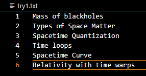
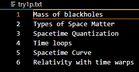

# copy-file
## AIM:
To write a python program for copying the contents from one file to another file.
## EQUIPEMENT'S REQUIRED: 
```
PC,Anaconda - Python 3.7
```
## ALGORITHM: 
### Step 1:
Start the python program.
### Step 2: 
 Open one Plain Text File in read mode.(input file)
### Step 3: 
Open another  Plain Text File in write mode.(output file)
### Step 4:  
Open both the plain text files in program using open() method.
### Step 5: 
Read each line from the input file using for loop and write it into the output file.

### Step 6: 
Exit.
## PROGRAM:
```
Name:Sai Darshan
Register Number:21003195
with open("try1.txt") as f:
    with open("try1p.txt", "w") as f1:
        for line in f:
            f1.write(line)
```
### OUTPUT:
```
Input file:
```

```
Output file(Before execution):
```

```
Output file(After execution):
```


## RESULT:
Thus the program is written to copy the contents from one file to another file.